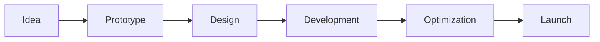

# <div align="center">Prasad</div>

<div align="center">

### Frontend Engineer • Creative Developer • Building Interactive Digital Experiences

<br/>


</div>

---

<table>
<tr>
<td width="65%" valign="top">

## ✦ Currently Building

```text
◉ Enterprise Dashboard Systems
◉ Interactive 3D Web Experiences
◉ Cross-platform Mobile Applications
◉ Agentic AI Workflows
```

### Design Philosophy

> Create interfaces that feel effortless,
> performant, and memorable.

</td>

<td width="35%" valign="top">

```text
Location
────────────
🌏 India

Status
────────────
🟢 Open to collaboration

Focus
────────────
⚡ Creative Frontend
```

</td>
</tr>
</table>

---

# Bento Grid

<table>
<tr>
<td width="50%">

### ⚛ Frontend

```text
React.js
Vue.js
Angular
TypeScript
Next.js
```

</td>

<td width="50%">

### 🌌 Creative Coding

```text
Three.js
Canvas API
GSAP
Web Animations
Motion Design
```

</td>
</tr>

<tr>
<td>

### 🚀 Backend

```text
Node.js
Express.js
MongoDB
PostgreSQL
REST APIs
```

</td>

<td>

### 🛠 Workflow

```text
Git
GitHub
Vercel
Docker
Figma
```

</td>
</tr>
</table>

---

## Selected Projects

```text
◉ 3D Product Configurator
   → Three.js + React

◉ Learning Management Platform
   → React Native + Node.js

◉ Enterprise Approval System
   → Angular + Express

◉ Interactive Data Dashboard
   → React + Canvas
```

---

## Toolbox

<p align="center">


</p>

---

## Development Mindset



---

## GitHub Analytics

<p align="center">


</p>

---

## Current Energy

```text
Frontend Development    ████████████████ 95%
Three.js                ███████████████  90%
Canvas Animation        ██████████████   88%
UI Engineering          ████████████████ 93%
Problem Solving         ███████████████  89%
```

---

<div align="center">

### Building products where engineering meets creativity.

<br/>

*"The details are not the details. They make the design."*

</div>
